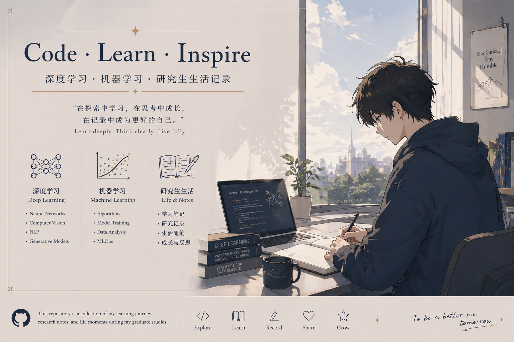

  

 

  <!-- 徽章区 -->
  
  
  
  

---

> **"在探索中学习，在思考中成长，在记录中成为更好的自己。"**  
> *Learn deeply. Think clearly. Live fully.*

Notes, research, and projects from my Master's in Software Engineering at SWJTU (2026–2029).

---

## ## Before Graduate School — Learning Roadmap

To prepare for my research, I'm working through machine learning and deep learning in three stages:

| Stage                | Content                        | Resources                         |
|----------------------|--------------------------------|-----------------------------------|
| **Python Basics**    | Fast-track if already familiar | —                                 |
| **Machine Learning** | Theory-focused                 | Zhou Zhihua's course, Li Hongyi   |
| **Deep Learning**    | Hands-on PyTorch               | Li Mu's *Dive into Deep Learning* |

> This structured approach balances theory and practice — essential for research preparation.

---

## ## Repository Structure

...